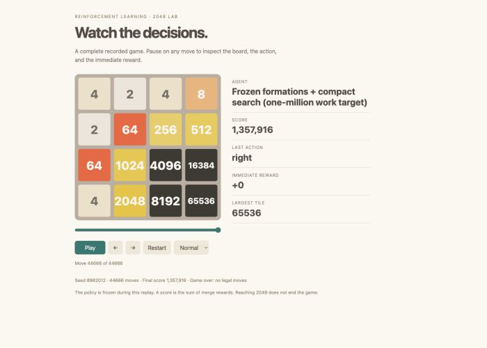

# 2048: reinforcement learning, for fun and research

I built this project **for fun and research**: to learn reinforcement learning by implementing it, watching the games, and testing what actually improves play. Built with substantial coding and experiment assistance from Codex, starting with full-board Q-learning and eventually exploring neural networks, teacher distillation, search, and endgame tables.

**Best verified local game: 1,357,916 points · 65,536 tile · 44,666 moves.**



This player combines frozen formation tables with compact expectimax search. It builds on credited external engines; this score is **not a claim that a transformer learned to play at this level**. Standard 4×4 rules, two initial tiles, 90% new 2s / 10% new 4s, no undo, no restarting the recorded game, natural game over. Seed: `8982012`.

[Recorded game](docs/record/replay.html) · [Exact action sequence](docs/record/actions.json) · [Models, equations and lessons](docs/MODELS.md) · [Reproduction and limitations](docs/REPRODUCING.md)

Download the replay HTML and open it in a browser, or serve the repository locally; GitHub's file viewer does not execute HTML. The screenshot is captured from that replay. The verification command below regenerates the game independently from its seed and actions.

## How this compares with published scores

The highest comparable **no-undo score I found in an identifiable author's code repository** is **1,704,908**, reported by [MacroXue's 2048 AI](https://github.com/macroxue/2048-ai#2048---ai), with reproduction instructions. This is an author-published result, **not an independently certified all-internet world record**. Different variants, undo-assisted games and theoretical maxima are not comparable. Sources checked September 12, 2026. A [video listing also advertises 3.8 million points](https://justplay2048.com/videos); its no-undo conditions were not verified, so it is not used as the comparable benchmark.

A new campaign is attempting up to **1,000 fresh games with 16 CPU workers**, bounded to 12 hours, using the unchanged player behind the local record. All attempts, failures and time limits are retained locally. Record hunting increases opportunities for an exceptional game; it does not by itself demonstrate that the policy improved. This README reports completed, verified evidence only.

## What was tested

These are selected results from different experiments, **not a single budget-matched leaderboard**. Means are raw game points; “selection” means those games were available for choosing models. Details and equations are in [the model notes](docs/MODELS.md).

| Family | Selected measured result | Main lesson |
|---|---:|---|
| Random / full-board tabular Q-learning | 1,126 / 1,105 mean, 100 held-out games | Whole boards almost never repeat; a dictionary cannot generalize. |
| MLP Double DQN / dueling | Double DQN 3,318 mean, 100 held-out games | Learning useful values was harder than adding width or layers. |
| Locally trained n-tuple values + planning | 353,812 mean, 100 held-out games | Local patterns, symmetry and afterstates fit 2048 unusually well. |
| PPO / discrete SAC | PPO 8,725 held-out mean; SAC 3,670 selection mean | More sophisticated objectives did not automatically solve exploration. |
| BC / AWR / IQL / CQL | BC 8,974; AWR 5,924; IQL 3,277 held-out means; CQL 3,125 selection mean | Teacher data helped, but offline learning could not simply inherit teacher strength. |
| Transformers / QR-DQN | QR 7,585 vs scalar Q 3,925 mean across three training seeds | Distributional values helped this recipe; larger models alone did not. |
| 1-, 3-, 5-step TD | 5,419 / 7,585 / 6,647 three-seed means | Three steps was best here, with substantial seed variation. |
| Deeper inference planning | Same frozen Q model: 41,031 → 56,191 mean, depth 2 → 3 | Looking ahead at decision time is different from multi-step TD training. |
| REINFORCE | Initialized transformer finished at 5,956 vs initial 6,514 | A promising intermediate checkpoint was not lasting improvement. |
| Pretrained CNN / careful adaptation | Original 81,623 selection mean | Aggressive fine-tuning destroyed an already useful policy; KL anchoring helped preserve it. |
| Search + endgame tables | Earlier timed hybrid: 636,750 mean on 100 fresh games | Structured planning delivered the largest scores; record player uses a separate fixed-work budget. |
| Direct GPT play | 12,252 in one game | One manually played game is not an average-strength comparison. |

The central lesson: **representation, data coverage, target quality and decision-time planning mattered more than model size**. We inspected transitions and terminal boards, rather than trusting loss curves alone. Small screens often looked exciting and then failed larger comparisons.

## Run it

Python 3.13 and [uv](https://docs.astral.sh/uv/) are required. CPU is sufficient for the lessons. Neural experiments support CPU/MPS; the strongest search player is CPU work, so filling the GPU would not accelerate it.

```bash
uv sync --locked
uv run pytest -q tests/test_game.py tests/test_q_learning.py tests/test_experiments.py
uv run python -m scripts.verify_record
uv run python -m rl2048.train --steps 2000 --out runs/my_smoke
uv run python -m rl2048.evaluate --checkpoint runs/my_smoke/checkpoint.npz --out runs/my_eval
uv run jupyter lab
```

Start with `lessons/01_q_learning.ipynb`. See [Lesson 01](docs/LESSON01.md) for the detailed execution path and full training commands. Native search experiments require additional upstream sources, generated tables and builds; the multi-gigabyte caches and trained checkpoints are not in this repository.

```text
rl2048/game.py       → board rules, score, spawning and legal moves
rl2048/agents/       → action selection, models and learning updates
rl2048/*_train.py    → readable training/evaluation loops
lessons/            → explanations, worked updates and experiments
research/           → experimental runners, audits, reports and native adapters
scripts/            → public record verification and pinned-source setup
docs/              → results narrative, screenshot, replay and provenance
```

## Credit and license

The original project code and this combined research distribution use [GPL-3.0](LICENSE); separately credited MIT files retain their notices. See [NOTICE.md](NOTICE.md). In particular, credit goes to **MacroXue**, **game-difficulty**, **moporgic**, and **tsangwpx** for the search engines, tablebases, n-tuple reference implementation and pretrained CNN used in these experiments. Their algorithms and pretrained work are not claimed as inventions of this project.
