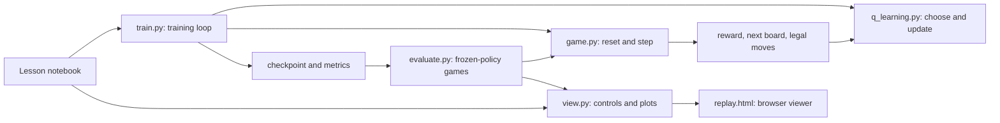

# Learn RL by building 2048

Historical lesson guide. Saved `runs/` artifacts and the local dashboard mentioned below are not bundled; rerun the commands to create your own.

This is a teaching project on the **full 4×4 game**. Lesson 01 implements a random
baseline and tabular Q-learning. Later experiments now include afterstate
n-tuples, expectimax, PPO, discrete SAC, and offline AWR/IQL/CQL.

The goal of the first lesson is to understand every transition and learning
update. Tabular Q-learning is expected to struggle: a slightly different board
gets an entirely different table entry. The experiments measure that limitation.

**Update:** tile sizes now remain fixed when cells are empty. We also tested nine
Q-learning settings across three training seeds. Read [the comparison](MODELS.md)
and open `lessons/01b_q_learning_variations.ipynb` to study the improved agent,
which shares ten learned weights across board features. The original exact-board
table and lesson remain available for comparison.

**Research extension:** see [the algorithm and file map](MODELS.md),
[the live local dashboard](http://127.0.0.1:8848/research/index.html), and the
advanced notebooks in `lessons`. Published pretrained results are explicitly
separate from local training.

## First completed experiment · September 6, 2026

The initial run is already saved in `runs/q_learning`: **100,000 transitions,
846 completed games, 8.35 seconds of CPU training** on this M5 Pro Mac. Timing
excludes checkpoint compression. There are 98,121 distinct updated boards and
1,879 repeated-state updates (1.879%).

| Frozen-policy evaluation, 100 held-out games | Random | Q-learning |
|---|---:|---:|
| Mean raw score | 1125.84 | 1105.32 |
| Median raw score | 1056 | 968 |
| Score standard deviation across games | 517.75 | 634.86 |
| Mean moves | 120.61 | 118.28 |
| Games reaching 256 | 8% | 11% |
| Games reaching 512 | 0% | 0% |

This run does not show a clear improvement over random play. Only 3.035% of
evaluation decisions encountered a board present in the learned table. That
is an observable limitation of memorizing whole boards with this data budget,
not evidence that reinforcement learning cannot learn 2048.

Open `runs/q_learning/replay.html` for a complete 113-move demonstration game
(score 944, largest tile 64). Full evaluation records are in `runs/q_eval` and
`runs/random_eval`; training and evaluation plots are in `runs/q_learning`.
The notebook's 2,000-transition gamma comparison produced identical Q tables
for gamma 0 and 0.99, illustrating zero bootstraps on unseen next states.

Validation: 29 tests passed, all 28 notebook cells executed in a fresh kernel,
and the standalone replay was played through to its final board in a browser.
Generated runs stay local and are excluded from Git; the notebook retains its
executed explanations and plots.

## Start here

```bash
uv sync --locked
uv run jupyter lab lessons/01_q_learning.ipynb
```

Use **Run → Run All Cells** for the complete lesson, or work through it one cell
at a time. The notebook has playable controls, equations, a real transition
trace, training curves, an evaluation, and a replay. It uses Python functions
from this project rather than hiding a second implementation in notebook cells.

Python 3.13 is pinned in `.python-version`; `uv.lock` pins the dependencies.
Jupyter uses the project's Python kernel. If selecting a kernel manually,
choose the interpreter at `.venv/bin/python`.

## Run experiments from the terminal

Run these commands from the project folder. Each training run requires a new
output directory, so an old checkpoint cannot be overwritten accidentally.

```bash
# 1. Check the rules and learning math.
uv run pytest -q

# 2. Quick check: 2,000 interactions with the game.
uv run python -m rl2048.train --steps 2000 --out runs/my_smoke

# 3. First learning experiment: 100,000 interactions.
uv run python -m rl2048.train --out runs/my_q_learning

# 4. Evaluate both agents on the same 100 held-out game seeds.
uv run python -m rl2048.evaluate --out runs/my_random_eval
uv run python -m rl2048.evaluate --checkpoint runs/my_q_learning/checkpoint.npz --out runs/my_q_eval

# 5. Record a complete frozen-policy game and open its replay.
uv run python -m rl2048.view --checkpoint runs/my_q_learning/checkpoint.npz --out runs/my_q_learning/replay.html --open
```

Training defaults: `alpha=0.1`, `gamma=0.99`, seed `0`, and epsilon decreasing
linearly from `1.0` to `0.1` across the first 100,000 actions. A smoke run uses
the same schedule; it does **not** compress exploration into 2,000 steps.
Use `--help` on a command to see its explicit parameters. This lesson runs on
CPU; PyTorch is installed for later neural-network lessons and is not involved
in the current Q table.

The transition budget can stop midway through a game. That unfinished game is
reported separately, not treated as a completed episode. Ctrl-C saves completed
updates. A checkpoint contains the Q table, visit counts, learner parameters,
and action RNG state; it is for inspection/evaluation and does not resume an
in-progress environment trajectory.

## How the files work together



| File | Responsibility | Read it when… |
|---|---|---|
| `rl2048/game.py` | Pure sliding/merging functions and the Gymnasium environment | You want to see exactly how an action becomes the next board and reward |
| `rl2048/agents/random_agent.py` | Uniformly samples a legal action | You want the simplest possible baseline |
| `rl2048/agents/q_learning.py` | Board keys, epsilon-greedy actions, one Q update, checkpoints | You want to connect the RL equation to code |
| `rl2048/agents/feature_q.py` | Engineered features, linear Q updates, and a greedy-merge control | You want learning to transfer between boards |
| `rl2048/train.py` | Configuration, explicit training loop, CSV/JSON output | You want to follow the whole learning process |
| `rl2048/variations.py` | Parameter experiments and an explicit feature-Q training loop | You want to run a different setting |
| `rl2048/compare_variations.py` | Selects a setting on validation, then tests its three trained seeds on fresh games | You want to understand the comparison method |
| `rl2048/evaluate.py` | Complete games with no learning, shared evaluation seeds and metrics | You want to understand what performance numbers mean |
| `rl2048/view.py` | Notebook controls, replay recording, and Matplotlib plots | You want to see how the game and results are displayed |
| `rl2048/replay.html` | Self-contained HTML/JavaScript template for saved replays | You want to inspect the browser playback controls |
| `rl2048/__init__.py` | Exposes `Game2048` as a package import | You want to understand `from rl2048 import Game2048` |
| `rl2048/agents/__init__.py` | Marks the agents directory as a Python package | You are exploring Python package organization |
| `lessons/01_q_learning.ipynb` | Guided explanation and runnable experiments | Start here |
| `lessons/01b_q_learning_variations.ipynb` | Feature equations, an annotated weight update and measured comparisons | Study why the improved agent works |
| `variations.md` | Experiment settings, measured results and reproduction commands | You want the results of the variation study |
| `tests/test_game.py` | Movement, spawning, seeds, terminal states, Gymnasium contract | You want evidence that the rules are correct |
| `tests/test_q_learning.py` | Hand-calculated targets, masks, exploration, saving | You want evidence that the learning math is correct |
| `tests/test_feature_q.py` | Semi-gradient arithmetic, generalization, frozen evaluation and checkpoints | You want evidence that the feature-Q update is correct |
| `tests/test_experiments.py` | Training → checkpoint → evaluation → replay and widget callbacks | You want to verify how components connect |
| `pyproject.toml`, `.python-version`, `uv.lock` | Package definition, Python selection, exact dependencies | You are setting up or reproducing the environment |
| `.gitignore` | Excludes local environments, caches and generated runs from Git | You want to know what is source code versus a local result |
| `README.md` | Commands, architecture and curriculum | You need an overview |

There is no inheritance hierarchy for agents, separate training framework, or
hidden RL library. NumPy stores numbers; our functions implement the algorithm.

### Follow one training step

1. `train()` holds `board` and `info["action_mask"]`.
2. `agent.act()` explores randomly with probability epsilon; otherwise it
   chooses the legal action with the highest table value. Ties are random.
3. `env.step()` merges, spawns a tile after a valid move, and returns the
   next board, immediate reward, end flags, and next legal-action mask.
4. `agent.update()` uses that transition to update **one** number in the table.
5. The loop advances to the next board, or resets after an episode ends.
6. `evaluate()` later selects actions from the frozen table without updating it.

## The first learning equation

For the observed transition `(s, a, r, s_next)`:

```text
next_value = max Q(s_next, legal next action)   # zero at natural termination
target     = r + gamma * next_value
td_error   = target - Q(s, a)
Q(s, a)    = Q(s, a) + alpha * td_error
```

- `s`: all 16 tile values, in row order. Empty cells contain zero.
- `a`: one of `0=up`, `1=right`, `2=down`, `3=left`.
- `r`: the sum of tile values created by this move's merges.
- `Q(s, a)`: an estimate of discounted future merge reward after action `a`.
- `alpha`: how much the current estimate moves toward the target.
- `gamma`: how much future reward contributes to the target.
- `epsilon`: exploration probability; it affects action selection, not this update equation.

Example: if `Q(s,a)=2`, `r=4`, the best legal next value is `10`,
`gamma=0.99`, and `alpha=0.1`, then the target is `13.9`, the TD error is
`11.9`, and the updated estimate is `3.19`.

This is off-policy learning: the action used to **collect** experience can be
random, but the target uses the greedy legal next action. We will make that
distinction concrete when we implement SARSA.

### Rules that matter for learning

- Start with two tiles. Each spawn chooses an empty cell uniformly, then a 2
  with probability 90% or a 4 with probability 10%.
- A tile merges once per move: `[2,2,4,0]` becomes `[4,4,0,0]`, reward `4`.
- The raw cumulative game score is the sum of merge rewards. We do not reshape
  or normalize reward in this lesson.
- The game continues beyond 2048 and terminates when no legal moves remain.
- Invalid moves change nothing, give zero reward, and do not consume spawning
  randomness. Agents avoid them using masks. They count as a step if supplied
  manually through the API.
- A `TimeLimit` wrapper caps experiments at 10,000 moves per game. A timeout
  resets the episode but still permits bootstrapping from the final observed
  board; natural termination sets the bootstrap value to zero.
- Reading unseen boards returns zeros without inserting new Q-table entries.
  Thus evaluation cannot silently train or inflate state coverage.

## Understand the saved results

Each training directory contains:

| Artifact | Meaning |
|---|---|
| `config.json` | All training parameters, including the seed and exploration schedule |
| `runtime.json` | Python, OS, relevant package versions and CPU device |
| `episodes.csv` | One row per finished episode: score, length, largest tile, end flags and timing |
| `coverage.csv` | Table growth and repeated-state statistics every 1,000 transitions |
| `summary.json` | Runtime, completed updates, coverage, and any unfinished episode |
| `checkpoint.npz` | Compressed portable arrays and JSON metadata, with no pickle |
| `replay.html`, `replay.json` | Viewer and exact recorded boards, actions, rewards and final outcome, created by the watch command |

Evaluation saves its own `summary.json` and `episodes.csv`. It uses fixed game
seeds `1,000,000` through `1,000,099`, independent of the training RNG stream.
Each game also has a separately seeded action RNG; the agent's original RNG
is restored afterward. Matching game seeds standardizes initial randomness,
but different action sequences can produce different subsequent spawn histories.

Metrics include raw mean/median score and standard deviation, mean episode
length, maximum-tile distribution, tile-reaching rates, transition count and
elapsed time. Standard deviation describes variation across games; it is not
a confidence interval or variation across independent training runs.

`known_state_fraction` is the fraction of evaluated decisions whose exact board
exists in the Q table. `repeated_update_fraction` is the fraction of training
updates that revisit an already updated board. Neither measures visits to each
individual **state-action pair**. A very large table with almost no revisits is
evidence for why we will need generalization.

The notebook's single-factor experiment changes `gamma` from `0.99` to `0`,
holding the budget, seed, learning rate and exploration schedule fixed. If the
results match, inspect next-state values and coverage: unseen next states have
value zero, so discounting cannot yet affect those targets. Do not conclude
that future rewards never matter from this small experiment.

## Later lessons

| Stage | Implementations | Question |
|---|---|---|
| 1, now | Random baseline and tabular Q-learning | What changes during one RL update? |
| 2 | Monte Carlo control, SARSA, Expected SARSA | What changes when we use full returns or a different bootstrap? |
| 3 | DQN, Double DQN | How can experience on one board help on another? |
| 4 | REINFORCE, learned value baseline | How can we optimize the policy directly? |
| 5 | Actor–critic, n-step returns, GAE, PPO | How do value estimates help policy learning? |
| 6 | Dueling networks, prioritized replay, symmetry augmentation | Which improvement actually helps under a controlled comparison? |
| 7 | Afterstate values, expectimax | How can learning and planning exploit the game's structure? |

Later comparisons use three independent training seeds and report variation.
When neural networks arrive, benchmark CPU and Apple MPS on this machine before
choosing a default, with an explicit device override. Continuous-action methods
such as DDPG and TD3 will use a more suitable future environment.
