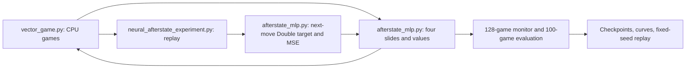

# A different prediction problem: neural afterstate values

The overnight study now includes fresh neural-only afterstate MLPs. This tests
the overall learning recipe, rather than only changing the width of a Q network.
It does not restart the old, user-stopped fair-comparison experiment.

## Why test this?

Our transition audits found inaccurate action rankings even for moves with a
high immediate probability of ending the game. Exact planning helps greatly,
and longer direct-policy training does not always improve planning. We should
therefore test what the network is being asked to predict, alongside replay,
exploration, discounting, model architecture and inference search.

[Matsuzaki (2021), Developing Value Networks for Game 2048 with Reinforcement
Learning](https://www.jstage.jst.go.jp/article/ipsjjip/29/0/29_336/_article)
studies neural afterstate learning with CNNs, and reports benefits from restart
and jump-start training. Its long, 120-hour experiment is motivation, not a score
we expect this short MLP screen to reproduce. We have not implemented that
paper's whole recipe here.

Our earlier paired afterstate study reached only 40,448 shared transitions and
used engineered relational inputs. That is insufficient evidence against this
new, longer, simple-input neural formulation.

## Input, calculation, output

An **afterstate** is the board immediately after a legal slide/merge, before
the random 2 or 4 appears. The real game still spawns that tile normally.

Let `x = slide(s,a)`. The network's scalar `U(x)` estimates future merge points
starting with the **next** move, divided by 128. The action score is

`Q(s,a) = immediate_merge_points(s,a)/128 + gamma * U(slide(s,a))`.

We enumerate the four deterministic root slides and select the largest legal
score. There is no expansion of future random spawn branches. This is more
simulator work than a direct four-output Q network, which is recorded explicitly.

The exponent model receives 16 tile ranks divided by 16. The embedding model
replaces each rank with a learned 16-number vector, then flattens the 256 numbers.
Each has two 512-unit ReLU layers and one linear output. There are no engineered
80 features, snake bonuses, hard corner constraints, or teacher values. Parameter
counts differ: 271,873 versus 395,041, so the encoding comparison is not capacity
matched. Both start with a zero scalar readout; initially, exact immediate merge
points determine the greedy action.

## Where the data and targets come from

The learner plays 128 independent CPU games. After its chosen slide, the game
samples the usual tile spawn. Replay stores `(x_t, s_(t+1), terminated)`; a reset
never replaces that transition's actual next state.

For each replay example, enumerate the legal slides from `s_(t+1)`:

`a* = argmax_a [r_(t+1)(a)/128 + gamma * U_online(slide(s_(t+1),a))]`

`y = r_(t+1)(a*)/128 + gamma * U_target(slide(s_(t+1),a*))`

`loss = mean[(U_online(x_t) - stop_gradient(y))^2]`.

For a naturally terminal next state, `y = 0`. Time limits still bootstrap.
Notice that `y` includes the **next move's** reward. The current merge reward
was already earned before `x_t`, so adding it again would double-count it.
The target network follows the updated online network with rate 0.005.

This is a greedy, off-policy one-step control target with uniform replay, not
supervised imitation. The actual spawn is sampled; its expectation is learned
through experience. Exact enumeration covers next slides, not all next spawns.

## Budget and comparison

Each fresh seed-0 screen gets 4,194,304 real transitions, with a 30-minute training
safety budget. Batch 512, one update per 128 collected moves, warmup 16,384,
replay capacity 1,000,000, gamma 1, AdamW learning rate 0.0001, weight decay 0.01,
gradient norm cap 10, epsilon 1 to 0.05 over 500,000 transitions.

A short full-sized MPS compatibility benchmark measured a median 7.31ms for a
collection/inference/slide/update cycle while other research was running. This
is a runtime estimate, not an isolated hardware benchmark or learning result.

Monitor the same 128 games every 524,288 transitions. Evaluate final and
monitor-selected best checkpoints on the separate 100 selection games. Save
a complete replay on fixed diagnostic seed 8930100. Reserved final-test seeds
remain untouched. Keep algorithm, parameter count, real experience and wall time
visible when comparing with QR-DQN; several recipe components differ.

The existing GPU queue launches `afterstate_mlp512_exponents_seed0`, followed by
`afterstate_mlp512_embedding_seed0`. Do not manually start another GPU worker
while that queue is active. Both honor the shared `scaled_transformer/STOP` file.

## Follow-up: average all possible spawns when constructing the target

The new `afterstate_embedding_expected_seed0` experiment keeps the original
embedding model, acting rule and training settings. It replaces the sampled
spawn label with an exact probability-weighted average. If afterstate `x` has
`E` empty cells, a2spawn in a particular cell has probability `0.9/E`, and a4spawn
has probability `0.1/E`. No branch is dropped.

For each possible spawned board `s_j`, independently select the best legal next
slide using the online model, and evaluate it using the target model:

`a*_j = argmax_a [r(s_j,a)/128 + gamma * U_online(slide(s_j,a))]`

`y(x) = sum_j p_j [r(s_j,a*_j)/128 + gamma * U_target(slide(s_j,a*_j))]`.

A terminal spawned board contributes zero. There is no extra copy of the
already-earned current merge reward. The MSE and optimizer are unchanged.
This is a model-based learning backup: exact game rules help construct targets.
The acting policy still only compares its four root slides, with no extra chance
search. Its real games still generate the ordinary random2/4tiles.

For a fixed afterstate and fixed networks, averaging removes the randomness of
which spawn supplies the target. It does not remove approximation error, changing
weights, replay sampling or evolving data coverage. The two recipes play their
own games and can diverge as learning changes their actions; equal transition
budgets do not mean identical datasets.

The screen receives4,194,304 real transitions or30training minutes. An early-board,
512-example MPS update benchmark measured34.87ms for the expected target versus
6.24ms sampled, under concurrent research load. Later boards have fewer empty
cells and hence fewer branches. Both real moves and simulated spawn/slide counts
are saved, so extra model-based compute cannot be mistaken for free data.

Implementation: `rl2048/afterstate_expectation.py` generates chance outcomes and
their probabilities; `AfterstateLearner.expected_targets` evaluates next slides in
bounded chunks. Mathematical tests cover probability mass, terminal outcomes,
Double selection, and a hand-calculated90%nonterminal/10%terminal target. CPU
training/save/reload/evaluation/replay and full-sized MPS updates passed before
the full experiment was queued.

## Follow-up: learn local patterns with convolutions

The `afterstate_cnn224_embedding_seed0` screen keeps the learned 16-dimensional
tile embeddings, sampled-spawn target, optimizer, exploration, batch and data
budget. It replaces the MLP with three learned 2x2 convolution layers, each with
224 channels and ReLU. Without padding, the spatial sizes are 4x4 → 3x3 → 2x2 →
1x1. A scalar linear readout starts at zero, matching the MLP's initial greedy
merge policy. There is no pooling, teacher or engineered board feature.

The first filters learn local patterns with weights shared across positions.
After three layers, the receptive field includes the complete board. This is
our architecture design, motivated by the CNN afterstate literature above;
we are not reproducing the paper's full recipe. Parameter counts are close,
but not identical: CNN 416,929 versus MLP 395,041, about 5.54% more.

Budget: 4,194,304 real moves or 30 training minutes. A full 512-example early-board
MPS update benchmark measured 29.65ms for the CNN and 6.17ms for the MLP under
concurrent research load. The batches were nearby early-game states, not exactly
identical. Around 16 minutes of CNN updates are expected before collection and
evaluation overhead; this estimate is not a learning result. Tests cover input
layout, all tiles reaching the readout, learning through the embedding and saved
architecture reload. A complete CPU smoke run and finite MPS updates passed.

As with other screens, replicate or extend based on complete raw-score results,
and report both sample efficiency and wall-clock cost. The unchanged MLP run
already exceeded its original 4M screen; do not compare its longer-trained score
with a fresh CNN as though they had equal experience.

## Eight equivalent board orientations

With raw merge points and uniform random tile positions, rotations and
reflections preserve the game. The scalar afterstate value should therefore
assign equivalent boards the same value. Let G contain the eight rotations
and reflections. We can define

`U_sym(x) = (1/8) sum_{g in G} U_base(g(x))`.

An inference-only test used the frozen 29.36M-transition MLP. On 100 matched CPU
games, ordinary values averaged 19,177.72 points and eight-view values averaged
26,590.08. No weights changed. Both compared four root slides, with no future
spawn search; the ensemble evaluated more network inputs. Evaluation times
were 2.59 and 9.99 seconds. This is one learned source and a reused selection
suite, not independent training-seed confirmation.

The next matched fine-tuning pair starts from that same saved plain MLP's
policy, target network and AdamW state. One arm keeps ordinary values. The
other uses the eight-view average for acting, TD targets and predictions. Its
gradient is the average of the gradients through all eight views:

`gradient U_sym(x) = (1/8) sum_{g in G} gradient U_base(g(x))`.

The same 395,041 learned parameters are shared across every view. This differs
from randomly rotating individual training examples: averaging is part of the
function used during both learning and inference. No human-designed strategic
features are supplied. The current reward contract remains raw points/128,
gamma1 and one-step sampled-spawn afterstate learning.

The explicit `symmetry_warm_start_from_plain` conversion permits only a plain
afterstate MLP to become its symmetric version with the same dimensions and
encoding. All learned policy/target tensors and optimizer state are retained;
the only new tensor is the fixed permutation buffer. Unexpected tensor changes
are rejected. Both arms refill replay and use collection seed 10200000, epsilon
0.05, and 4,194,304 new moves or 30 training minutes. Their initial monitoring
scores will differ because their acting functions differ from the first move.

Invariance, gradient, checkpoint reload, and complete CPU conversion/training
tests passed. A full 512-example MPS update plus 128-board collection cycle
measured 16.79ms symmetric versus 7.77ms plain on the same fixed batch under
concurrent load. This suggests about nine minutes for the symmetric 4M screen,
with additional reporting overhead. Actual runtime is recorded.

Implementation: `SymmetricAfterstateMLP` in `rl2048/agents/afterstate_mlp.py` is
the differentiable model; `research/afterstate_symmetry_screen.py` reproduces
the earlier inference-only comparison. Its saved `frozen` directory contains
the original weights: the eight-view inference setting in the adjacent config
is also required to recreate that policy. New symmetric training checkpoints
record their architecture directly and reload through `AfterstateMLPAgent`.

## Explicit planning with scalar leaves

`rl2048/agents/afterstate_planning.py` can expand one, two or three actual moves.
One move is the ordinary root-slide policy. Two moves average all intervening
spawn outcomes and maximize the next slide's reward plus scalar continuation;
three moves repeat this once more. No probability cutoff is applied.

`Q_1(s,a) = r(s,a)/128 + gamma U(slide(s,a))`

`Q_d(s,a) = r(s,a)/128 + gamma sum_spawn p(spawn) max_b Q_(d-1)(spawn(slide(s,a)), b)`.

Terminal spawned states contribute zero. The depth counts are specific to this
afterstate leaf convention and should not silently be equated with Q-network
search depth labels. `research/afterstate_search_experiment.py` freezes weights,
records complete games, and resumes saved boards/RNG states after a time budget.
Its unit checks use independent raw-board recursion and resumed-game agreement.
